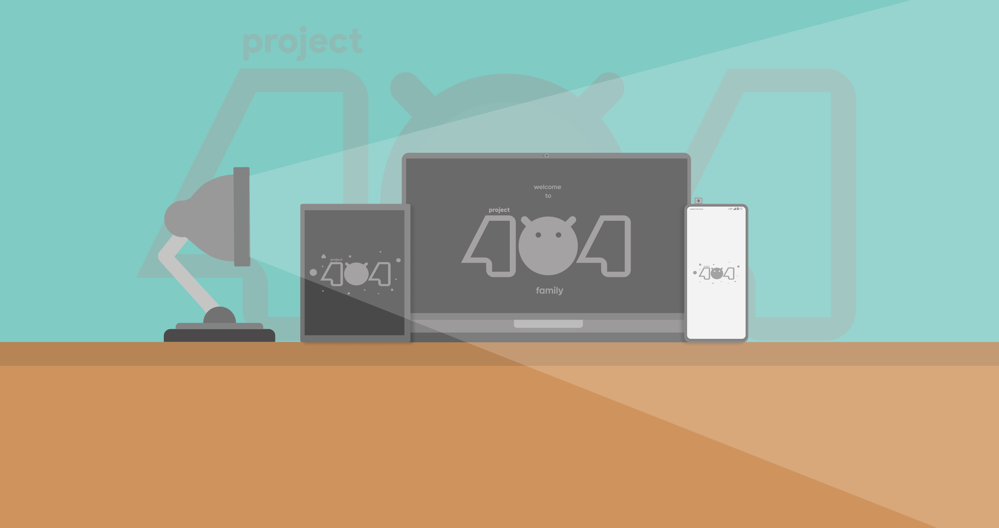

# Getting started with Project 404
<!-- ALL-CONTRIBUTORS-BADGE:START - Do not remove or modify this section -->

<!-- ALL-CONTRIBUTORS-BADGE:END -->

**You can find the XDA template here:** [Click Me!](XDA_ThreadTemplate.txt)

# Maintainership Application

**To make your device official and be the official maintainer, you must fulfill all the requirements as mentioned below.**

## Requirements:

-   Applicant should be having a good knowledge over the use of GitHub and Gerrit.
-   A proper commit history with authorship should be maintained for all of the commits being done or cherry-picked.
-   The [build variant](https://source.android.com/setup/build/building#choose-a-target) should be *user* (p404_device-user) or *userdebug* (p404_device-userdebug).
-   People maintaining more than 2 ROMs won't be allowed.
-   Applicant should have a Telegram Account to be in touch with the [team](https://t.me/project_404) .
-   Be respectful towards everyone and don't spread hate.

**Form can be found here:** [Maintainership Application Form](https://docs.google.com/forms/u/1/d/e/1FAIpQLSdtC5marlgSWWy_bBbuZff2PANhSjqnFzaozPh4PGkm8sEUpg/viewform)

# Contact Us

**Email:** [projectnotfound404@gmail.com](mailto:projectnotfound404@gmail.com)

**Telegram:** [@project_404](https://t.me/project_404)

## Contributors ✨

Thanks goes to these wonderful people ([emoji key](https://allcontributors.org/docs/en/emoji-key)):

<!-- ALL-CONTRIBUTORS-LIST:START - Do not remove or modify this section -->
<!-- prettier-ignore-start -->
<!-- markdownlint-disable -->
<table>
  <tr>
    <td align="center"><a href="http://project404.us/"> <b>project404bot</b></a> <a href="https://github.com/P-404/stuff/commits?author=project404bot" title="Code">💻</a></td>
    <td align="center"><a href="http://t.me/namaskaragusthi"> <b>Sena</b></a> <a href="https://github.com/P-404/stuff/commits?author=namaskaragusthi" title="Code">💻</a></td>
    <td align="center"><a href="https://without.live"> <b>Waxaranai</b></a> <a href="https://github.com/P-404/stuff/commits?author=Waxaranai" title="Code">💻</a></td>
    <td align="center"><a href="https://github.com/Nesquirt"> <b>Simone </b></a> <a href="https://github.com/P-404/stuff/commits?author=Nesquirt" title="Code">💻</a></td>
    <td align="center"><a href="http://anticovid.tech"> <b>Sourav Jagtap</b></a> <a href="https://github.com/P-404/stuff/commits?author=resist15" title="Code">💻</a></td>
    <td align="center"><a href="https://github.com/clhexftw"> <b>clhex</b></a> <a href="https://github.com/P-404/stuff/commits?author=clhexftw" title="Code">💻</a></td>
  </tr>
</table>

<!-- markdownlint-restore -->
<!-- prettier-ignore-end -->

<!-- ALL-CONTRIBUTORS-LIST:END -->

This project follows the [all-contributors](https://github.com/all-contributors/all-contributors) specification. Contributions of any kind welcome!