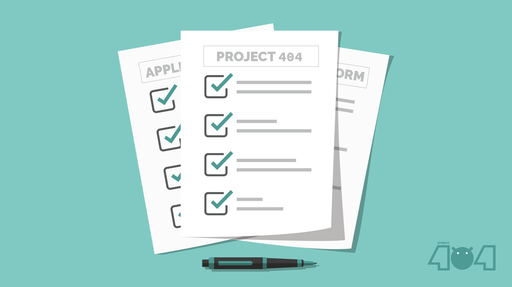

# Getting started with Project 404

**Having problems configuring gerrit?**
Here's a [guide](https://gist.github.com/Yash-Garg/b328ec514f77f8519aac17136c0069d6) that will help.

**You can find the XDA template here:** [Click Me!](XDA_ThreadTemplate.txt)

# Maintainership Application

**To make your device official and be the official maintainer, you must fulfill all the requirements as mentioned below.**

## Requirements:

-   Applicant should be having a good knowledge over the use of GitHub and Gerrit.
-   A proper commit history with authorship should be maintained for all of the commits being done or cherry-picked.
-   People maintaining more than 3 ROMs won't be allowed.
-   Applicant should have a Telegram Account to be in touch with the team.
-   Be respectful towards everyone and don't spread hate.

**Form can be found here:** [Maintainership Application Form](https://docs.google.com/forms/u/1/d/e/1FAIpQLSdtC5marlgSWWy_bBbuZff2PANhSjqnFzaozPh4PGkm8sEUpg/viewform)

# Contact Us

**Email:** [projectnotfound404@gmail.com](projectnotfound404@gmail.com)

**Telegram:** [@project_404](https://t.me/project_404)
